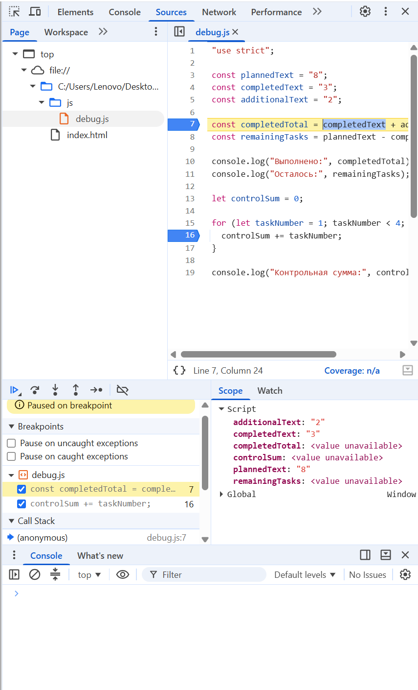

# Практическая работа № 1


## 1. Автор и вариант

Имя: Поликарпов Евгений
Группа: ЭФБО-03-25
Номер в журнале: 17  
Вариант: 1  


Данные моего варианта:

```text
totalTasks = 12
completedTasks = 5
dailyLimit = 3
```

## 2. Окружение

Операционная система: Windows 11
Node.js: v24.15.0
npm: 12.0.2
Git: git version 2.55.0.windows.5
Браузер: Microsoft Edge, Версия 153.0.4234.32  

Версии Node.js, npm и Git проверял командами:

```bash
node --version
npm --version
git --version
```

## 3. Запуск

Все команды выполнял из корня репозитория `tip-js-practices`.

Обязательные задания запускал командами:

```bash
node practice-01/js/hello.js
node practice-01/js/types.js
node practice-01/js/progress.js
node practice-01/js/plan.js
node practice-01/js/debug.js
```

Дополнительное задание:

```bash
node practice-01/js/progress-input.js
```

Для запуска в браузере открывал:

```text
practice-01/index.html
```

Для проверки нужного файла менял путь в `script`, сохранял `index.html`, обновлял страницу и смотрел результат во вкладке `Console`.

Перед сдачей вернул в `index.html`:

```html
<script src="./js/hello.js" defer></script>
```

## 4. Задание 1. Один файл — две среды выполнения

Файл `hello.js` проверил через Node.js и через браузер.

При запуске через Node.js:

```text
Тип document: undefined
```

При запуске в браузере:

```text
Тип document: object
```

Разница появляется потому, что `document` относится к браузерному окружению и используется для работы с HTML-страницей. При обычном запуске через Node.js объекта `document` нет.

При запуске через Node.js результат выводился в терминал, а в браузере — во вкладку `Console`.

## 5. Задание 2. Типы данных и преобразования

Проверил все десять выражений из задания.

| Выражение | Ожидание до запуска | Фактическое значение | Тип результата | Объяснение |
|---|---|---|---|---|
| `"8" + 2` | `"82"` | `"82"` | `string` | При сложении со строкой выполняется объединение значений в строку. |
| `"8" - 2` | `6` | `6` | `number` | При вычитании строка `"8"` преобразуется в число. |
| `Number("8") + 2` | `10` | `10` | `number` | `Number()` явно преобразует строку `"8"` в число. |
| `"12" > "3"` | `false` | `false` | `boolean` | Сравниваются две строки, а не два числа. |
| `12 === "12"` | `false` | `false` | `boolean` | `===` сравнивает и значение, и тип без преобразования. |
| `Number("")` | `0` | `0` | `number` | Пустая строка через `Number()` преобразуется в `0`. |
| `Number("text")` | `NaN` | `NaN` | `number` | Текст `"text"` нельзя преобразовать в обычное число. |
| `Boolean("false")` | `true` | `true` | `boolean` | Непустая строка преобразуется в `true`. |
| `typeof null` | `"object"` | `"object"` | `string` | `typeof null` возвращает строку `"object"`. |
| `typeof NaN` | `"number"` | `"number"` | `string` | `NaN` относится к числовому типу, а результат `typeof` является строкой. |

Отдельно обратил внимание на два последних случая.

Для:

```js
typeof null
```

получается:

```text
object
```

но сам результат `typeof` имеет тип `string`.

Для:

```js
typeof NaN
```

получается:

```text
number
```

и этот результат тоже имеет тип `string`.

## 6. Задание 3. Сводка выполнения задач

В файле `progress.js` использовал данные своего варианта:

```text
totalTasks = 12
completedTasks = 5
```

Основной результат:

```text
Всего задач: 12
Выполнено: 5
Осталось: 7
Прогресс: 41.7%
Статус: В работе
```

Также проверил остальные случаи из задания.

| Входные данные | Ожидаемый результат | Фактический результат | Итог |
|---|---|---|---|
| `12`, `5` | Осталось 7, 41.7%, «В работе» | Осталось 7, 41.7%, «В работе» | Пройдено |
| `0`, `0` | `Задач пока нет` | `Задач пока нет` | Пройдено |
| `5`, `0` | Осталось 5, 0.0%, «Не начато» | Осталось 5, 0.0%, «Не начато» | Пройдено |
| `5`, `5` | Осталось 0, 100.0%, «Завершено» | Осталось 0, 100.0%, «Завершено» | Пройдено |
| `5`, `6` | Ошибка | `Ошибка: некорректные данные о количестве задач` | Пройдено |
| `-1`, `0` | Ошибка | `Ошибка: некорректные данные о количестве задач` | Пройдено |
| `5`, `2.5` | Ошибка | `Ошибка: некорректные данные о количестве задач` | Пройдено |
| `"5"`, `2` | Ошибка | `Ошибка: некорректные данные о количестве задач` | Пройдено |
| `1001`, `0` | Ошибка | `Ошибка: некорректные данные о количестве задач` | Пройдено |
| `NaN`, `0` | Ошибка | `Ошибка: некорректные данные о количестве задач` | Пройдено |

После проверок вернул в файл значения своего варианта:

```js
const totalTasks = 12;
const completedTasks = 5;
```

## 7. Задание 4. План выполнения задач

Для задания использовал:

```text
totalTasks = 12
completedTasks = 5
dailyLimit = 3
```

Получил:

```text
Осталось задач: 7
День 1: выполнено 3, осталось 4
День 2: выполнено 3, осталось 1
День 3: выполнено 1, осталось 0
Потребуется дней: 3
```

В решении использовал цикл `while`.

На каждом шаге уменьшается количество оставшихся задач. В последний день выполняется только то количество задач, которое реально осталось.

### Проверки

| Входные данные | Ожидаемый результат | Фактический результат | Итог |
|---|---|---|---|
| `12`, `5`, `3` | 3 дня, в последний день 1 задача | 3 дня, в последний день 1 задача | Пройдено |
| `10`, `4`, `3` | 2 дня | 2 дня | Пройдено |
| `5`, `3`, `10` | 1 день, выполнено 2 задачи | 1 день, выполнено 2 задачи | Пройдено |
| `5`, `5`, `2` | 0 дней | `Потребуется дней: 0` | Пройдено |
| `0`, `0`, `2` | 0 дней | `Потребуется дней: 0` | Пройдено |
| `5`, `2`, `0` | Ошибка | `Ошибка: некорректные входные данные` | Пройдено |
| `5`, `2`, `1.5` | Ошибка | `Ошибка: некорректные входные данные` | Пройдено |
| `5`, `6`, `2` | Ошибка | `Ошибка: некорректные входные данные` | Пройдено |
| `5`, `2`, `"2"` | Ошибка | `Ошибка: некорректные входные данные` | Пройдено |
| `5`, `2`, `1001` | Ошибка | `Ошибка: некорректные входные данные` | Пройдено |

После проверок вернул значения своего варианта:

```js
const totalTasks = 12;
const completedTasks = 5;
const dailyLimit = 3;
```

## 8. Задание 5. Отладка через DevTools

В исходном варианте `debug.js` получил неправильный результат:

```text
Выполнено: 32
Осталось: -24
Контрольная сумма: 6
```

По условию должно было получиться:

```text
Выполнено: 5
Осталось: 3
Контрольная сумма: 10
```

Для поиска ошибки открыл `debug.js` во вкладке `Sources` DevTools и поставил breakpoint на строке вычисления `completedTotal`.

В `Scope` увидел:

```text
completedText = "3"
additionalText = "2"
```

Оба значения были строками.

После выполнения строки получилось:

```text
completedTotal = "32"
```

Причина в том, что оператор `+` для двух строк выполнил их объединение.

Также проверил цикл через breakpoint внутри него. Условие:

```js
taskNumber < 4
```

обрабатывало только числа `1`, `2` и `3`.

Поэтому сумма получалась:

```text
1 + 2 + 3 = 6
```

Вместо нужной:

```text
1 + 2 + 3 + 4 = 10
```

### Скриншот отладки



### Найденные ошибки

| Ошибка | Что происходило | Причина | Как исправил | Результат |
|---|---|---|---|---|
| Сложение выполненных задач | Получалось `"32"` вместо `5` | Складывались две строки | Добавил преобразование через `Number()` | Получилось `5`, остаток `3` |
| Граница цикла | Контрольная сумма была `6` | Условие `< 4` не включало число `4` | Заменил `< 4` на `<= 4` | Контрольная сумма стала `10` |

После исправления получил:

```text
Выполнено: 5
Осталось: 3
Контрольная сумма: 10
```

Исправленный файл проверил через Node.js и браузер.

После завершения отладки точки останова убрал.

## 9. Дополнительное задание

Выполнил вариант А — обработка данных, которые поступают строками.

Для этого создал отдельный файл:

```text
practice-01/js/progress-input.js
```

Сначала проверяю, что входные значения действительно являются строками.

После этого использую:

```js
trim()
```

чтобы убрать пробелы по краям.

Пустую строку проверяю отдельно до вызова `Number()`.

Это нужно потому, что:

```js
Number("")
Number("   ")
```

возвращают:

```text
0
```

Но пустой ввод в этом задании должен считаться ошибкой.

После этого строки преобразуются через `Number()` и проверяются по тем же ограничениям, что и в задании 3.

### Проверки

| Входные данные | Фактический результат | Итог |
|---|---|---|
| `"12"`, `"5"` | Прогресс 41.7%, статус «В работе» | Пройдено |
| `"  12  "`, `"  5  "` | Пробелы убраны, расчёт выполнен | Пройдено |
| `""`, `"5"` | `Ошибка: введено пустое значение` | Пройдено |
| `"   "`, `"5"` | `Ошибка: введено пустое значение` | Пройдено |
| `"abc"`, `"5"` | `Ошибка: некорректные данные о количестве задач` | Пройдено |
| `"5"`, `"2.5"` | `Ошибка: некорректные данные о количестве задач` | Пройдено |
| `"Infinity"`, `"5"` | `Ошибка: некорректные данные о количестве задач` | Пройдено |
| `null`, `"5"` | `Ошибка: входные данные должны быть строками` | Пройдено |
| `undefined`, `"5"` | `Ошибка: входные данные должны быть строками` | Пройдено |

Также сделал три дополнительные проверки:

| Входные данные | Фактический результат | Итог |
|---|---|---|
| `"0"`, `"0"` | `Задач пока нет` | Пройдено |
| `"5"`, `"5"` | 100.0%, статус «Завершено» | Пройдено |
| `"1001"`, `"0"` | `Ошибка: некорректные данные о количестве задач` | Пройдено |

После всех проверок вернул:

```js
const totalTasksText = "12";
const completedTasksText = "5";
```

## 10. Вывод

В этой практической работе я настроил окружение для JavaScript и проверил запуск файлов через Node.js и браузер.

Разобрался с типами данных, преобразованием значений, условиями и циклами. В заданиях добавил проверки, чтобы программа не принимала строки вместо чисел, дробные и отрицательные значения, а также значения за пределами нужного диапазона.

В задании с отладкой через DevTools увидел, что строки `"3"` и `"2"` при сложении дают `"32"`, поэтому добавил преобразование через `Number()`. Также исправил условие цикла, чтобы в сумму входило значение `4`.

Дополнительно сделал обработку входных данных, поступающих строками. Добавил проверку пустых строк, пробелов, неправильных числовых значений, `null` и `undefined`.

Все обязательные задания и дополнительное задание проверил на предусмотренных в работе примерах.